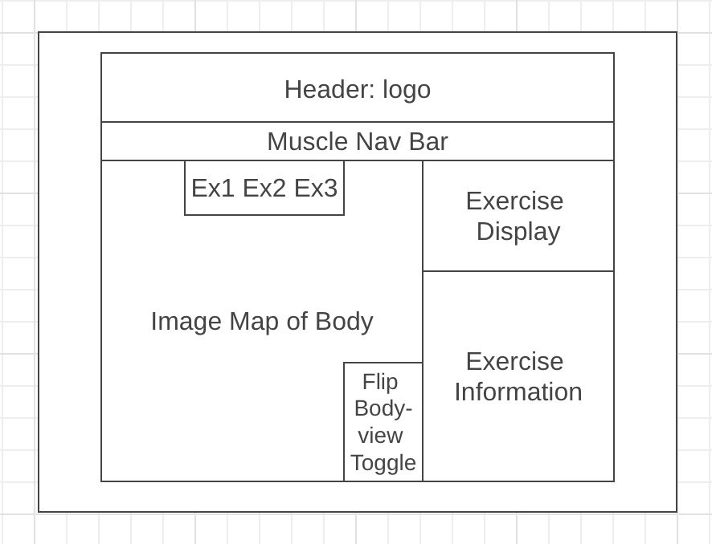

    

[myFitnessBuddy](https://bchoi28.github.io/myFitnessBuddy/), a single-page, web application, developed with only vanilla javascript, can serve as your personal workout routine generator. 

## MVP Features

With myFitnessBuddy, users are able to:
- Choose any clickable muscle region on Buddy which generates a random exercise for that region.
- View exercise instructions, primary/secondary musculature involved, and animated demonstration.
- Click a goal for that exercise which displays the recommended rep range for that goal.
- Select and deselect up to 4 exercises which are stored in a carousel.

## Technologies

* Languages: JavaScript, HTML5, CSS3
* API: [ExerciseDB](https://rapidapi.com/justin-WFnsXH_t6/api/exercisedb) (for fetching GIFs)
* Hosting: GitHub

## Main Wireframe

## App Demo

## Technologies Used

* Languages: JavaScript, HTML5, CSS3
* API: [ExerciseDB](https://rapidapi.com/justin-WFnsXH_t6/api/exercisedb) (for fetching GIFs)
* Hosting: GitHub

## Future Functionalities

- Ability to save exercise routines via localStorage
- Nav-bar with muscle names as alternate method for exercise generation
- Primary/secondary musculature re: displayed exercise highlighted on Buddy

## About Me

    

I am a fullstack software engineer proficient in JS/Ruby with a strong interest in creating seamless and intuitive user experiences. 
As a former Physical Therapist, I have redirected my passion for helping others and attention to detail towards the field of software engineering.
Connect with me on <a href="https://linkedin.com/in/brandonchoi28">LinkedIn!</a>